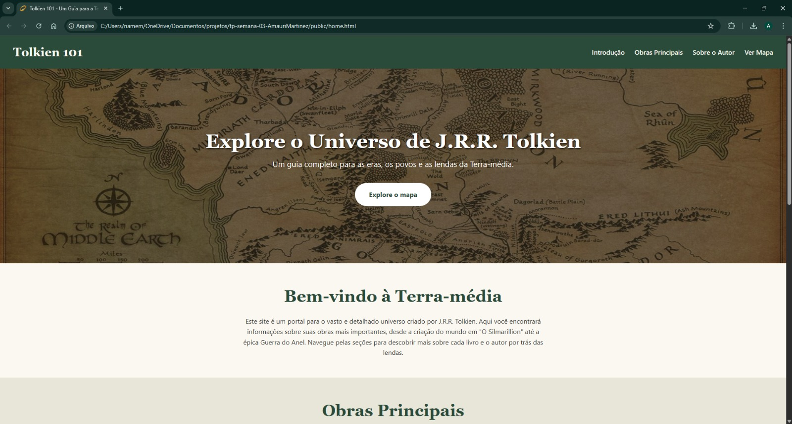
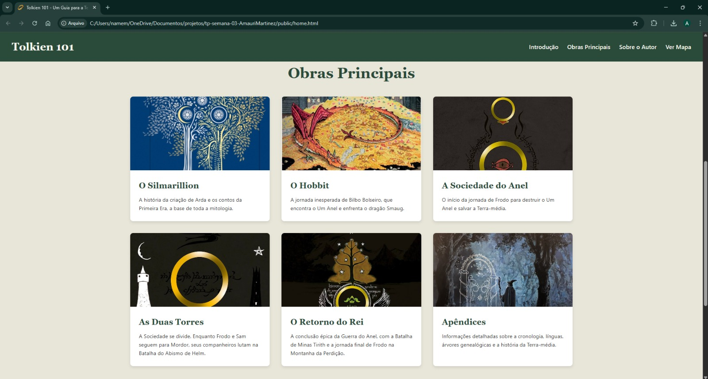
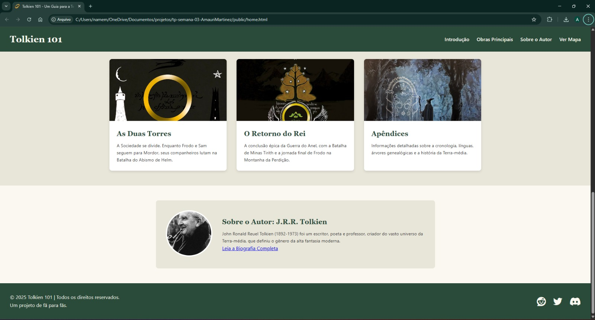
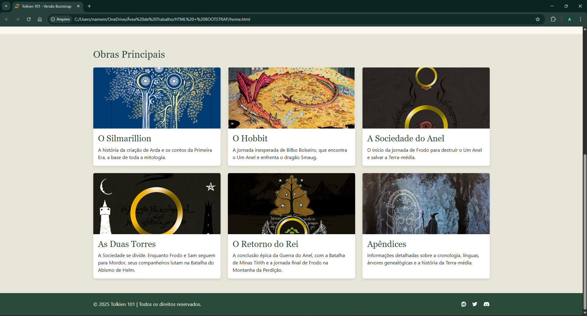

## Informações Gerais

- **Nome:** [Amauri Luca Martinez Azevedo]
- **Matrícula:** [902131]
- **Proposta de projeto escolhida:** [ Site informativo sobre as obras de J.R.R. Tolkien]

---

## Screenshots da Entrega

### Versão com CSS Puro

Aqui estão as prévias da versão final do projeto, estilizada exclusivamente com CSS.

Aqui estão as prévias da versão final do projeto, estilizada exclusivamente com CSS.

**Print 1: Visão Geral da Página**

**Print 2: Detalhe da Seção de Obras**

**Print 3: Detalhe do Rodapé e Seção do Autor**

### Versão com bootstrap

Aqui estão as prévias da versão final do projeto, estilizada exclusivamente com CSS.

**Print 1: Visão Geral da Página**

**Print 2: Detalhe da Seção de Obras**
